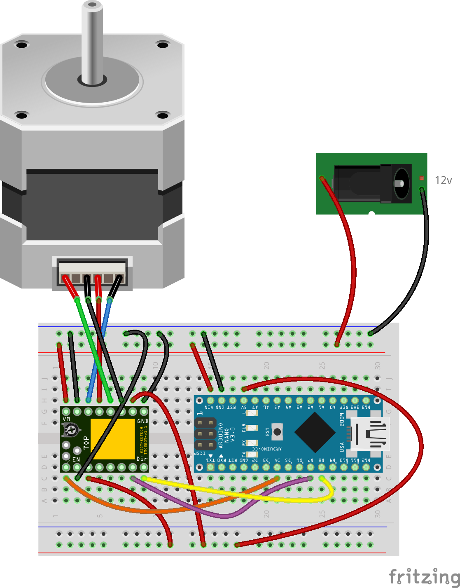

## Summary

A simple implementation of a stepper driver program intended to drive the stepper at one full rotation per minute, for a [TMC2208 stepper driver](https://wiki.fysetc.com/TMC2208/).  This driver is being used for this [Marble Clock](https://www.thingiverse.com/thing:4891112).

## Circuit

[Fritzing circuit design](fritzing/marble_clock.fzz)

This circuit does not take advantage of UART and sets the driver to X4 microstepping mode.
